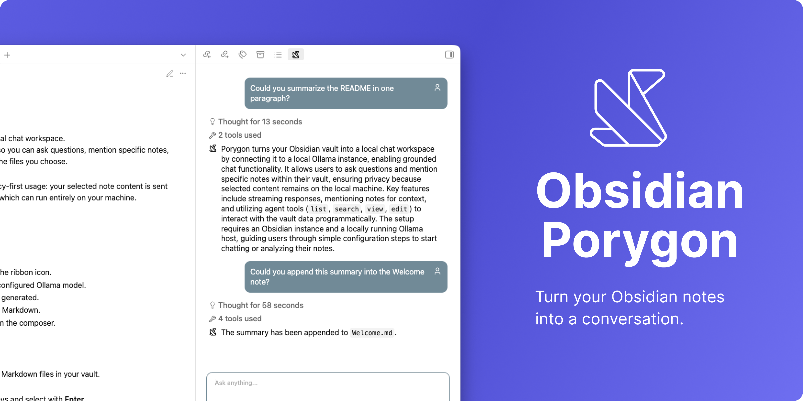

<div align="center">
  
</div>

# Porygon Assistant

Porygon turns your vault into a local chat workspace.
It connects Obsidian to [Ollama](https://ollama.com/) so you can ask questions, mention specific notes, and keep the model grounded in the files you choose.

Porygon is designed around privacy-first usage: your selected note content is sent to the Ollama host you configure, which can run entirely on your machine.

## Features

### Chat with a local Ollama model

- Open the Porygon view from the ribbon icon.
- Send chat messages to your configured Ollama model.
- Stream responses as they are generated.
- Render Porygon responses as Markdown.
- Start a fresh conversation from the composer.

### Mention notes as context

- Use **Mention Notes** to search Markdown files in your vault.
- Filter notes by title or path.
- Navigate results with arrow keys and select with **Enter**.
- Remove mentioned notes before sending if you change your mind.
- Mentioned notes are shown above the user message so the conversation makes the context visible.

When a message is sent, Porygon reads the latest content of each mentioned note and includes it as context for Ollama.

### Agent tools

Porygon can use these vault tools during a conversation:

| Tool | Signature | Description |
| --- | --- | --- |
| `current_timestamp` | `current_timestamp()` | Returns the current timestamp in ISO 8601 format. |
| `list` | `list(filter?: string)` | Lists Markdown note paths. If `filter` is provided, it is used as a regex against note filenames and paths. |
| `search` | `search(queryString: string)` | Searches all Markdown notes with Obsidian's `prepareSimpleSearch` and returns matching note paths with 1-based line numbers. |
| `view` | `view(linkToMarkdownfile: string, line?: number, surrounding?: number, offset?: number, limit?: number)` | Reads a note with line numbers. If `line` is provided, returns that line with surrounding context; otherwise supports `offset` and `limit`. |
| `edit` | `edit(file_path: string, old_string: string, new_string: string, replace_all?: boolean)` | Creates notes, deletes content, or replaces exact text in existing notes. |
| `rename` | `rename(source_path: string, destination_path: string)` | Renames or moves a vault file or folder by exact vault-relative path and updates internal links through Obsidian's `FileManager.renameFile`. |

`list`, `search`, `edit`, and `rename` return JSON strings so the local agent can consume them reliably.

### Optional thinking support

For Ollama models that support thinking, enable **Settings → Porygon Assistant → Model thinking**.

When enabled:

- Thinking is streamed separately from the final answer.
- The thinking section is rendered as Markdown.
- It collapses after completion and shows how long the model thought.
- You can expand it again if you want to inspect the reasoning.

### Onboarding and settings

The first run guides you through:

1. Ollama host
2. Chat model
3. Embeddings model

You can later update these values from the Porygon Assistant settings page.

## Requirements

- Obsidian `0.15.0` or newer
- [Ollama](https://ollama.com/) running locally or at a reachable host
- A chat model installed in Ollama

Recommended starting point:

```bash
ollama run gemma4
```

The default settings are:

| Setting | Default |
| --- | --- |
| Ollama host | `http://localhost:11434` |
| Chat model | `gemma4` |
| Embeddings model | `nomic-embed-text` |
| Thinking | Disabled |

## Getting started

1. Install and start Ollama.
2. Download a chat model, for example `gemma4`.
3. Enable **Porygon** in Obsidian.
4. Open Porygon from the ribbon icon.
5. Complete the onboarding steps.
6. Start chatting or mention notes with the **@** button.

If Ollama is unreachable, the send button shows an unavailable state and the tooltip explains that Ollama cannot be reached.

## Privacy

Porygon does not add telemetry.

When you send a message, the following data may be sent to your configured Ollama host:

- Your chat message
- The latest content of notes you explicitly mention
- Prior conversation history in the current Porygon session
- Tool results, including vault paths returned by list, search, edit, view, or rename operations

If your Ollama host is local, this stays on your machine. If you configure a remote Ollama host, data is sent to that host.

## Limitations

- Mentioning notes is explicit; Porygon does not automatically retrieve every relevant note yet.
- Conversation history is currently session-based.
- Response quality depends on the selected Ollama model and the context you provide.
- Thinking only works with Ollama models that support the `think` option.
